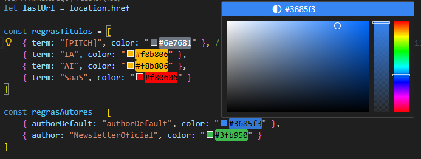

[](https://biomejs.dev/)


Use esta extensão, caso prefira que os artigos no [Tab News](https://www.tabnews.com.br) com o titulo "[PITCH]" mostre sempre "marcado como lido".  
Ela também vai destacar o nome do autor do artigo seguindo a mesma paleta de cores do site.

<p align="center">
  
</p>


***[Esta artigo](https://www.tabnews.com.br/DarleiC/madrugada-marcada-como-lida) no tabnews.com.br, explica o motivo e uso dessa extensão, pode usa-lo como ponto de discusão ou abrir uma issue por aqui***

### Configure os termos:

Use o arquivo `main.js`, para configurar os termos que deseja destacar. o array `regrasTitulos` para customizar a cor dos titulos dos artigos e `regrasAutores` para customizar os autores dos artigos:
```js
const regrasTitulos = [
	{ term: "[PITCH]", color: "#6e7681" }, //Rage mark use color #0D1117
	{ term: "AI", color: "#f8b806" },
	{ term: "SaaS", color: "#f80606" }
]

const regrasAutores = [
	{ authorDefault: "authorDefault", color: "#3685f3" },
	{ author: "NewsletterOficial", color: "#3fb950" }
]

```
>[!TIP]  
>Instale as extensões recomendadas para melhor configuração das cores, no caso a sugerida é a `vscode-ext-color-highlight`  
>
><p align="center">
>  
></p>

---
### Como carregar uma extensão descompactada no modo de desenvolvedor

<details>
    <summary>Chrome</summary>

    1. Acesse a página "Extensões" digitando `chrome://extensions` em uma nova guia.

        - Como alternativa, clique no botão de quebra-cabeça do menu "Extensões" e selecione **Gerenciar extensões** na parte de baixo do menu.

        - Ou clique no menu do Chrome, passe o cursor sobre **Mais ferramentas** e selecione **Extensões**.

    2. Ative o modo de desenvolvedor clicando no botão ao lado de **Modo de desenvolvedor**.

    3. Clique no botão **Carregar descompactado** e selecione o diretório em que esta repositório foi salvo
</details>
